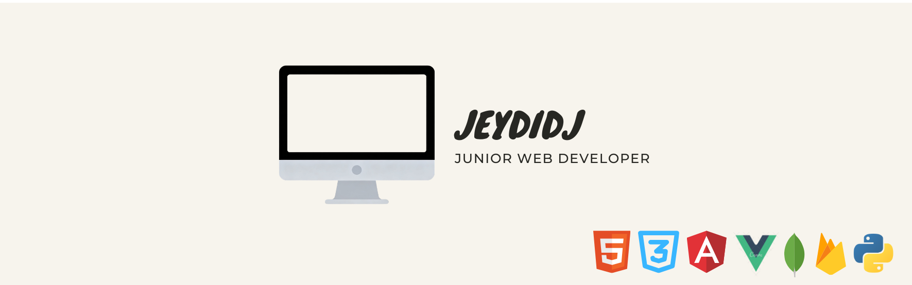

# JD De Jesus

  

  <strong>Web Developer focused on scalable applications, real-time systems, and modern UI/UX</strong>

  Open to Web Developer and Full-Stack roles

---

## About Me

I’m a web developer with real-world experience building scalable, performant, and user-focused applications.

I specialize in:
- Modern frontend frameworks (Angular, Vue, React, Next.js)
- Progressive Web Apps (PWA)
- Real-time systems and API integrations
- Clean, responsive, and intuitive UI/UX

I focus on building production-ready applications that are not only functional, but also efficient and maintainable.

---

## How I Build

- I design applications with scalability and maintainability in mind  
- I prioritize performance and responsiveness from the start  
- I focus on real-world usability, not just technical implementation  
- I structure code for clarity, modularity, and long-term growth  
- I iterate quickly and continuously improve based on feedback  

---

## Core Strengths

- Full-stack web development and system integration  
- API design and real-time data handling  
- Responsive and user-centered interface design  
- Progressive Web App development and optimization  
- Clean architecture and maintainable code practices  

---

## What I’m Currently Doing

- Building and refining full-stack web applications  
- Improving performance, scalability, and user experience  
- Exploring advanced frontend architecture and backend systems  
- Learning more about real-time applications and automation workflows  

---

## Tech Stack

 

 

 

---

## What I Bring

- Experience building full-stack applications from scratch  
- Strong understanding of data flow, APIs, and real-time updates  
- Focus on intuitive and user-centered UI/UX  
- Ability to ship quickly and iterate efficiently  
- Clean, modular, and maintainable code practices  

---

## Experience

- Junior Web Developer working on real-world applications  
- Built internal systems and full-stack web applications  
- Experience with modern frameworks and backend services  
- Freelance experience delivering custom web solutions  

---

## Opportunities

Open to:
- Junior Web Developer roles  
- Frontend Developer roles  
- Full-stack opportunities  

Interested in building scalable systems and contributing to real-world applications.

---

## GitHub Activity

  

  
  
  

---

## Connect With Me

  <a href="https://github.com/JeydiDJ">GitHub</a> • 
  <a href="https://dejesus-portfolio-lyart.vercel.app">Portfolio</a>

  

